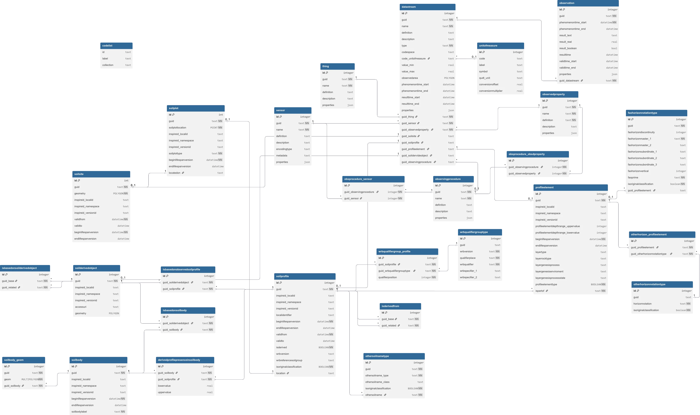

# SoilWise Geopackage-so

[](https://creativecommons.org/licenses/by/4.0/)
[](https://doi.org/10.5281/zenodo.18246824)


## Abstract
This repository provides resources for working with the **INSPIRE Soil (SO)** data model in **GeoPackage** format.  
It also includes an implementation based on the **OGC SensorThings API 2.0 (draft)** to expose soil observations and related metadata as interoperable time‑series via HTTP and MQTT. SensorThings 2.0 provides an open, geospatial‑enabled and unified way to interconnect sensor‑data‑producing devices, data, and applications over the Web. It defines a core data model aligned with OGC/ISO **Observations, Measurements and Samples (ISO 19156:2023)**, an abstract REST API, and protocol bindings for **HTTP** and **MQTT**, supporting CRUD operations, advanced filtering, customizable responses, and push notifications for data changes (via MQTT). *Note: SensorThings API 2.0 is currently a draft standard under development.*  
References: [STA 2.0 draft (OGC 23‑019)](https://hylkevds.github.io/23-019/23-019.html#_13d7055erThings overview (OGC)](https://www.ogc.org/standards/sensorthings/)

Updates previous versions developed within the **EJP SOIL** project (https://github.com/ejpsoil/inspire_soil_gpkg_template), with the goal of conforming to both **OMS** (https://docs.ogc.org/as/20-082r4/20-082r4.html) and **SensorThings API** (https://www.ogc.org/standards/sensorthings/) standards.

The **first version** of the INSPIRE Soil (SO) GeoPackage was developed under the H2020 **European Joint Research Programme EJP SOIL** (https://ejpsoil.eu/), the work package 6 aimed at supporting harmonised soil information and reporting. A so‑called “Software framework for a shared agricultural soil information system”, deliverable **EJP SOIL_D6.4**, was produced to enable transcoding and streamlining of interoperable and harmonised national agricultural soil data into **ESDAC** (https://esdac.jrc.ec.europa.eu/), as foreseen in the Grant Agreement, and in general to enable **INSPIRE‑compliant** soil data sharing.

---

## Knowledge Sources
This work is based on the following primary normative and technical resources:

- INSPIRE Soil theme: conceptual model (UML), feature catalogue, and implementation guidance (INSPIRE Soil Technical Guidelines).
- INSPIRE Good Practice: GeoPackage encoding for INSPIRE datasets.
- OGC GeoPackage standard.
- OGC SensorThings API 2.0 (STA2, draft) for observation/time‑series exposure via HTTP/MQTT.
- OMS / ISO 19156:2023 alignment for observation semantics.
- EJP SOIL INSPIRE‑SO GeoPackage template as baseline.

---

## Conceptual Model
The GeoPackage schema is a **relational transposition** of the INSPIRE Soil conceptual model (UML), preserving the core “soil investigation chain” and relationships:

- **SoilSite** → context/area of investigation  
- **SoilPlot** → investigation point/portion within a SoilSite  
- **SoilProfile** → vertical profile at a plot  
- **ProfileElement** → horizon or layer within a profile  
- **SoilBody** → mapping unit concept, linked to representative profiles

In addition, the model includes an **observational component** aligned with **STA2** concepts (e.g., Things, Datastreams, Observations, Sensors, ObservedProperties) to support time‑series exposure via standards‑based services.

<p>
  
</p>

---

## Overview of the INSPIRE‑SOIL GeoPackage
The SoilWise GeoPackage is designed to be:

- **GIS‑native**: editable and viewable directly in QGIS and other GeoPackage‑capable GIS tools.
- **Relational and traceable**: UML classes map to tables; UML associations map to foreign keys and link tables.
- **Semantically controlled**: code lists and controlled vocabularies are materialized as reference tables.
- **Interoperable across static + dynamic flows**:
  - **GeoPackage** provides structured “data‑at‑rest” soil datasets.
  - **STA2 alignment** provides a pathway to “data‑in‑motion” observation streams.

---
## Installation / Access
No installation is required. A GeoPackage is a single, portable file (.gpkg) that you simply [download](geopackage/SoilWise_empty/) and open. GeoPackage is an SQLite database container, so its content can be accessed and updated directly without intermediate format conversions.

### Recommended usage (GIS)
The GeoPackage can be used in any GIS that supports the GeoPackage format. We recommend QGIS as the reference GIS, and this repository provides custom QGIS forms and styles to facilitate data entry and visualization. 

### Programmatic access (R / Python)
Because a GeoPackage is an SQLite database file, it can also be accessed programmatically using standard SQLite tooling in R or Python (e.g., via SQLite drivers / bindings). 
In R, GeoPackage workflows are commonly supported via GDAL-backed packages and SQLite interfaces (e.g., terra/RSQLite-based tooling).

### Recreating the GeoPackage from scratch (optional)
It is also possible to rebuild your own GeoPackage from zero by starting from an empty GeoPackage and executing the SQL scripts shipped with this repository (DDL/DML and metadata population). 

Open the empty GeoPackage model: http://www.geopackage.org/data/empty.gpkg (e.g., with a DB manager like DBeaver).
Execute the SQL instructions using the provided SQL files (located in geopackage_ddl/):

- DDL_SO.sql — creates the full SoilWise database structure (tables + relationships).
- META_SO.sql — populates GeoPackage metadata (non‑INSPIRE format) to support read/write operations.
- DML_SO.sql — populates the codelist support table required for correct functionality.
- DML_SO_PPU_Glosis.sql — imports GLOSIS-compliant soil properties/procedures and related units of measure.

> [!NOTE]
> The SQL scripts required to recreate the GeoPackage are available in this repository under the geopackage_ddl/ folder

---

## Usage
This repository is meant to be used together with its [online technical documentation](https://soilwise-he.github.io/Geopackage-so/), which explains how the GeoPackage is structured and how it behaves as a database, before you start editing or importing data. The documentation (published as GitHub Pages) provides an overview of the SoilWise GeoPackage design, the INSPIRE‑derived relational model, and the practical guidance needed to populate the database correctly—especially where constraints, triggers, and cross‑table dependencies matter.

In particular, the Data Loading & Modelling Guide describes a deterministic loading order and data‑entry rules (e.g., the logical flow Site → Plot → Profile → Elements, observed vs derived objects, horizon vs layer behavior, and STA2 integration), and points you to the authoritative SQL/DDL definition for constraints and triggers. 
Complementary summaries (e.g., cascade behavior) help you understand what happens when rows are deleted or updated across related tables—useful when maintaining integrity in a relational GeoPackage. 

### Using the GeoPackage in QGIS (custom forms)
The primary operational workflow is to open the .gpkg in QGIS and work with it as a normal GIS‑native database. The repository includes a dedicated QGIS usage guide and a set of custom forms/styles (stored under qgis_style/) designed to make editing faster and safer: dropdowns, value relations, constraints, and a more user‑friendly layout for data entry and inspection. 

- Read the documentation to understand table roles, keys, and dependencies.
- Load the GeoPackage into QGIS and apply the provided custom forms/styles from this repository.
- Use the forms for consistent data entry and to reduce errors caused by missing required fields or invalid code‑list values.

You can find the QGIS‑specific guide [here](https://soilwise-he.github.io/Geopackage-so/qgis/). 

### Field survey workflow with QField
For field campaigns, the same GeoPackage‑based workflow can be taken into the field using QField, which is designed to consume fully configured QGIS projects (including customized feature forms) and work with SQLite‑based GeoPackages on mobile devices. 
The intended approach is to prepare and validate the project in QGIS first (with the custom forms and database constraints), then deploy it to QField for in‑situ observations and editing, and finally synchronize or bring edits back into the desktop environment—keeping the GeoPackage as the single source of truth for both office and field. 
You can find the QField field‑survey guide [here](https://soilwise-he.github.io/Geopackage-so/qfield/). 

---

## Repository Contents
```
.
├── README.md
├── Gemfile
├── documentation/            # Living technical documentation (model, guides, table reference)
├── geopackage/               # Example output .gpkg files for testing/validation
├── geopackage_ddl/           # SQL scripts: DDL/DML for schema creation and codelist/metadata population
└── .github/workflows/        # Automation (if applicable)
```

Key documentation entry point:
- `documentation/index.md` — overview, modelling rationale, loading guide, QGIS manual, and database tables reference.

---

## Soilwise-he project
This work has been initiated as part of the [Soilwise-he](https://soilwise-he.eu) project. The project receives
funding from the European Union’s HORIZON Innovation Actions 2022 under grant agreement No.
101112838. Views and opinions expressed are however those of the author(s) only and do not necessarily
reflect those of the European Union or Research Executive Agency. Neither the European Union nor the
granting authority can be held responsible for them.

