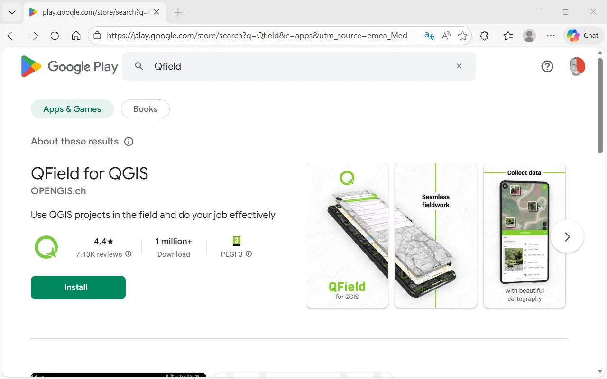
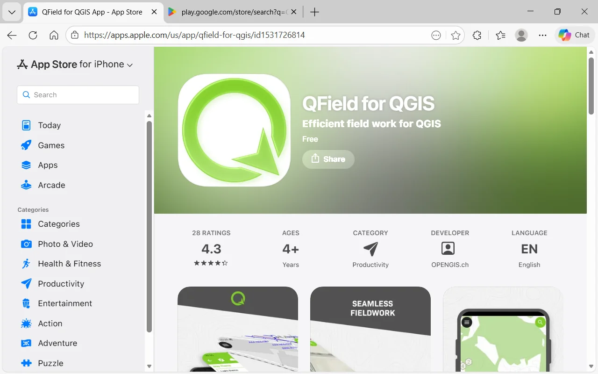
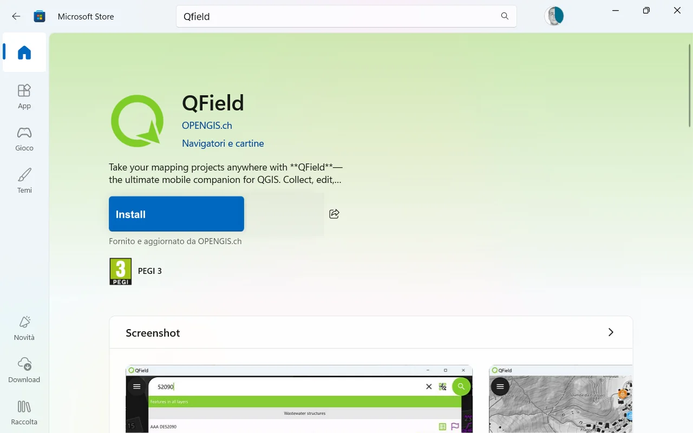

# What is QField
**QField** is a mobile application developed by *OPENGIS.ch* designed to bring the power and flexibility of GIS projects created in **QGIS** directly into the field. The main goal of QField is to allow technicians, researchers, and field operators to collect, view, and update geographic data directly from a smartphone or tablet, while maintaining **full interoperability** with the QGIS desktop environment.

Thanks to an intuitive interface optimized for touch devices and real-world working conditions, QField minimizes manual operations and provides fast tools for form filling, geolocation, and the acquisition of photos and media.

#### Main features
- **Offline/online editing** – Allows work even without a connection, saving changes locally with later synchronization.
- **Custom forms** – QField interprets and uses forms configured in QGIS (rules, widgets, required fields, default values).
- **Data management via GeoPackage** – A single container for vector data, raster files, attachments, and configurations.
- **Optimized touch interface** – Tools that can be easily used even with one hand.
- **Synchronization with QGIS through QFieldSync** – Enables preparation, export, and import of projects.
- **QFieldCloud support (optional)** – For real-time multi-user collaboration.

## Installing QField (Android, iOS, Windows)
Installing **QField** is simple and varies depending on the operating system used. The app is available for **Android**, **iOS**, and **Windows**, with consistent functionality adapted to different devices.

## Android

  
① Open <strong>Google Play Store</strong>.  
 
② Search for <strong>QField</strong>. 
 
③ Select the official <strong>OPENGIS.ch</strong> app. 
 
④ Tap <strong>Install</strong>.

   

>[!NOTE]
> Compatible with smartphones, tablets, and rugged devices used in field operations.

## iOS (iPhone/iPad)

  
① Open the <strong>App Store</strong>. 
 
② Search for <strong>QField</strong>. 
 
③ Tap <strong>Get</strong>.

   

>[!NOTE]
>On iOS, file transfer may require the Files app or cloud services.

## Windows (tablet rugged, Surface, laptop)
QField is also available for Windows through the Microsoft Store, ideal for rugged tablets, 2‑in‑1 devices, and laptops used for fieldwork.

  
①  Open the Microsoft Store on your Windows device. 
  
②  Type <strong>"QField”</strong> into the search bar. 
   
③  Select the official <strong>"QField”</strong> for Windowsapp developed by OPENGIS.ch. 
 
④ Click <strong>Install</strong> to start the download and automatic installation.

   

>[!NOTE]
> The app can be installed without administrative privileges (depending on company policies).  
>
> Once installed, QField will appear in the Start menu like any other Windows app.  
>
> It is particularly suitable for tablets with integrated GPS or rugged devices used for fieldwork.

