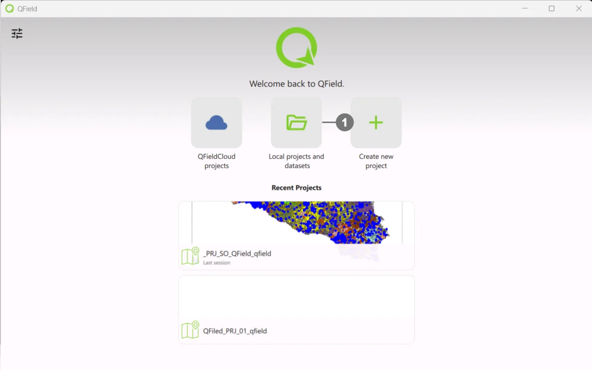
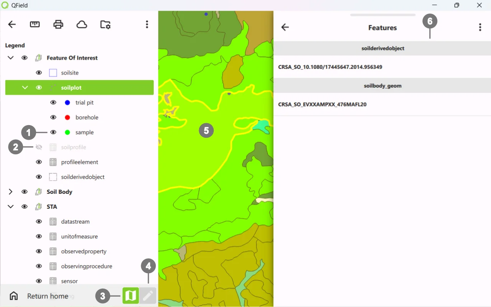

# QField — Quick Guide (Project Loading & Navigation)

## Open Soilwise Project

  
Start <strong>QField</strong>. 
 
Click on <strong>Local project and dataset</strong> ①  
 
Navigate through the file system folders and select the  <strong>`.qgs/.qgz project` </strong>. exported from the SoilWise Geopackage.  
   
Wait for layers and styles to load.

   

> [!TIP]
> If the project doesn't open or some layers are missing, check in QGIS that the **paths** are **relative** (*Project → Properties → Paths*).

## Interface Navigation

### Map
- **Pan/Zoom** (drag, pinch), **Rotation** (two fingers).
- **GPS**: target button to center on your position.

### Layer Panel

  
Visibility ① <strong>on</strong> - ② <strong>off</strong>  
 
Select the <strong>editing layer</strong> before editing. 
   
You can easily switch between ③ view mode and ④ edit mode whenever you need to make changes. 
   
When ⑤ selecting/creating, a<strong>form</strong> ⑥ opens: required fields, pick‑lists, dates, numbers.

   

> [!IMPORTANT]
> This is an introductory guide; for more details on using QField and its plugin, please refer to the [official documentation]( https://docs.qfield.org/).

### Mini‑troubleshooting
- **Inaccurate GPS** → wait for fix, enable high precision (settings), check location provider.
- **Slow map** → simplify symbology, reduce raster size, use lighter tiles.
