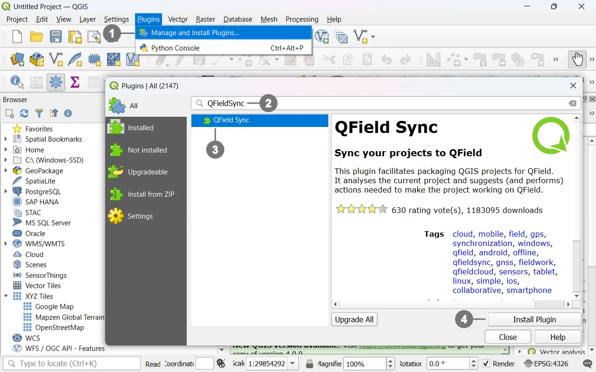
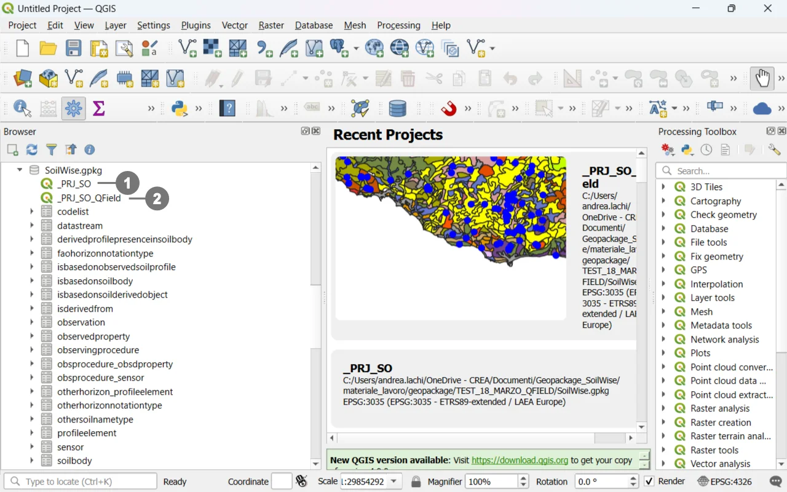
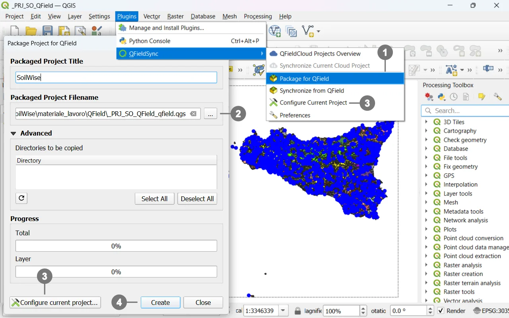
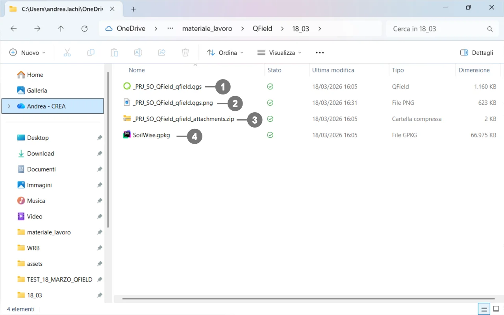

# QField – Operational Guide (QGIS ⇆ QField)
This short guide briefly describes:
- how to **install the QField plugin (QFieldSync) from QGIS**;
- how to **identify the projects** inside the provided **GeoPackage**;
- how to **export/package the QGIS project** for use with QField (Android, iOS, Windows);
- how to **transfer the data to the device** for use with QField (Android, iOS, Windows).

> [!IMPORTANT]
> This is an introductory guide; for more details on using QField and its plugin, please refer to the [official documentation]( https://docs.qfield.org/).

## Install the QField plugin from QGIS

### Step‑by‑step procedure

  
<strong>Open QGIS</strong> (Desktop). 
    
① Go to <strong>Plugins → Manage and Install Plugins…</strong>  
 
In the search field, type <strong>“QFieldSync”</strong> ② (in some installations it is shown as <strong>“QField”</strong>). 
    
Select <strong>QFieldSync</strong> ③ and click <strong>Install Plugin</strong>.④  
    
(Optional) Verify it is enabled: <strong>Installed</strong> tab → check <strong>QFieldSync</strong>.

   

### What the plugin enables
- **Layer configuration** for offline use (copy to GeoPackage, attachment handling).
- **Export/Packaging** of the project for QField.
- Conversion to **relative paths**, copying of resources (icons, media), inclusion of styles and forms.

> [!TIP]
> Before exporting, always save the QGIS project and ensure **paths are relative** (**Project → Properties → Paths**) to avoid broken links on the device.

## Identifying the project in the GeoPackage
The provided GeoPackage contains **two different QGIS projects** that point to the **same data source** (the same layers/tables in the same `.gpkg`):

  
① <strong>Project `_PRJ_SO` for QGIS – Optimized for desktop*</strong> use (full symbology, views, and tools for office work). 
 
②  <strong>Project `_PRJ_SO_QField` for QField – Optimized for mobile devices</strong> with <strong>custom forms</strong>, pre‑filled fields, simplified widgets, and constraints for field data capture. 

   

- **Project `_PRJ_SO` for QGIS** – Optimized for **desktop** use (full symbology, views, and tools for office work).
- **Project `_PRJ_SO_QField` for QField** – Optimized for **mobile devices** with **custom forms**, pre‑filled fields, simplified widgets, and constraints for field data capture.

Both projects use **the same GeoPackage** as their data source; this ensures consistency and alignment between office work and field work.

> [!NOTE]
> - Open `_PRJ_SO` in **QGIS** when working on desktop.
> - Open `_PRJ_SO_QField` in **QField** (or use it as the source for export via QFieldSync).

## Exporting/Packaging the QGIS project for QField

  
From the <strong>QFieldSync</strong> menu or toolbar, choose <strong>Export/Package for QField</strong>. ① 
    
Select the <strong>destination folder</strong>. ②  
    
③ Configure layers for offline use <strong>Project Configuration</strong>  
    
④ Start the export: the plugin will copy data, styles, and resources, converting paths to <strong>relative</strong> ones.

   

>[!TIP]
> For **each layer**, you can set the mode in **Project Configuration**:
> - **Copy to GeoPackage** *(recommended)*: creates an offline copy for field editing.
> - **Keep original path**: keeps the reference to the external file (less portable).
> - **Read‑only**: if it must not be edited.

>[!NOTE]
> Unless there are specific needs, it is discouraged to change the project configuration. The full export of the GeoPackage can be performed without altering the configuration.

### Typical resulting structure:

  
/Project_QField/ 
├─ <strong>project.qgs </strong> ① QGIS/QField project file. 
├─ <strong>image.png   </strong> ② Image used by the project (see notes below). 
├─ <strong>package.zip </strong> ③ Archive for distribution/transfer/Project_QField/ 
└─ <strong>database.gpkg </strong> ④ Data store (GeoPackage).

 
  
   

### What each file is for
- **`.qgs`** → The *project file* (map, layers, styles, forms). This is the file you open in **QGIS** and **QField**.

- **Best practice:** In QGIS, set **Project → Properties → Paths → ‘Store relative paths’** to avoid broken links on the device.

- **`.gpkg`** → The *GeoPackage* that contains your layers/tables and, if configured, attachments. QField reads and (optionally) edits this file offline.

- **`.png`** → An image referenced by the project. It may be used as one of the following:
  - **Project icon** (*Project Properties → General → Project icon*),
  - **Form image** (a widget in a custom form),
  - **Raster symbol/marker** in a layer style,
  - **Thumbnail** generated during export.

## Transfer to device
- **Android/iOS:** copy the folder/zip via **USB** or **cloud** (OneDrive/Drive/Nextcloud). On iOS, use the **Files** app or share directly with QField.
- **Windows:** copy the folder/zip and open the project with **QField for Windows**.

>[!WARNING]
>  **Write errors:** make sure layers are not read‑only and that the device allows writing to the project folder.  
> **Heavy rasters:** consider **resampling** or using lighter tiles for better performance on mobile.
