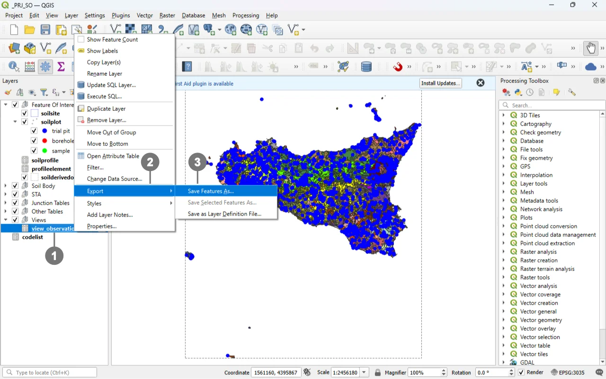
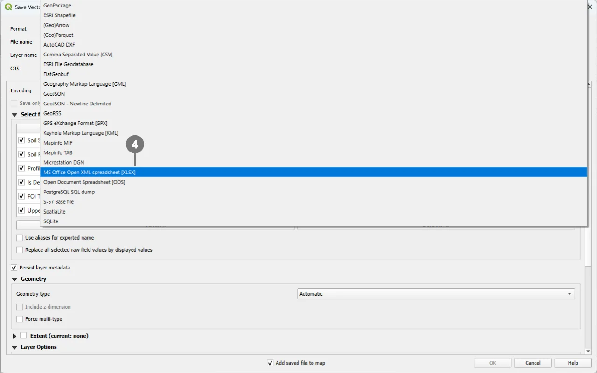
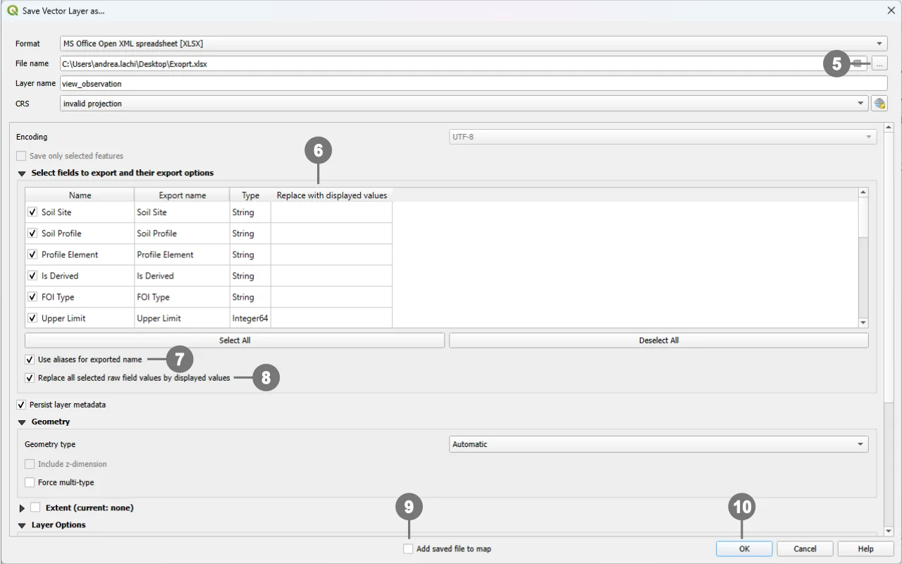

# Export to Excel

QGIS supports exporting layers to a wide range of formats to help you share, analyze, and report your data beyond the GIS environment. This short guide focuses specifically on **exporting to Microsoft Excel (XLSX)** using the project view **`view_observation`** as the working example. The same workflow applies—often with only minor differences—to **most vector layers and database views** you might have in your project.

> [!TIP]
> For further information on the  View Observation,  refer to the view [documentation](../tables/view_observation.md)
## Export the View Observation in Excel

  
① <strong>Select the object to export</strong> (in this case, your view) and <strong>right‑click</strong> to open the **context menu**.   
    
② Choose <strong>Export</strong>.   
  
③ Click <strong>ave Features As…</strong> to open the <strong>Export</strong> dialog.  

  

  
  ④ In the <strong>Export</strong> dialog, select the <strong>output format</strong> you need (for Excel: `MS Office Open XML spreadsheet [XLSX]`).  

  

  
⑤ Set the <strong>output file name</strong> and <strong>location</strong>. If needed, choose <strong>which fields to export</strong> ⑥ (by default, **all fields** are exported).   
  
⑦ <strong>By flagging "Use aliases for exported name"</strong>: column headers are exported using the <strong>field aliases</strong> (or the <strong>Export name</strong> set in the field mapping) instead of the raw database field names. This is useful when the file is intended for <strong>non‑technical users</strong> or when you need <strong>translated headers</strong> If the option is not selected, the <strong>original field names</strong> will be used. 
  
⑧  <strong>By flagging "Replace all selected raw field values by displayed values"</strong>: exports the <strong>values as displayed in QGIS</strong> (i.e., formatted values) instead of the raw database values—for example, <strong>Value Relation</strong> labels instead of keys, formatted <strong>date/time</strong> booleans as <strong>“Yes/No”</strong>, numeric formatting, etc. Enable this when you want a more <strong>human‑readable</strong> output; leave it unchecked if you need the <strong>original codes</strong> for further data processing. 
  
⑨ <strong>(Optional)</strong> Tick the option to <strong>add the exported file back to the current project</strong> after export (e.g., *Add saved file to map*), then click <strong>OK</strong> ⑩ to finish.

  

