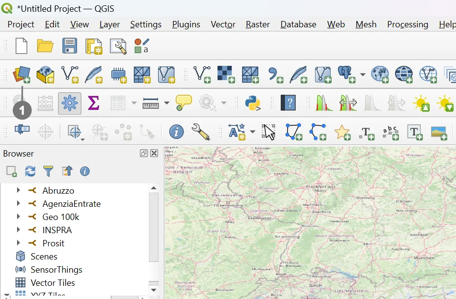
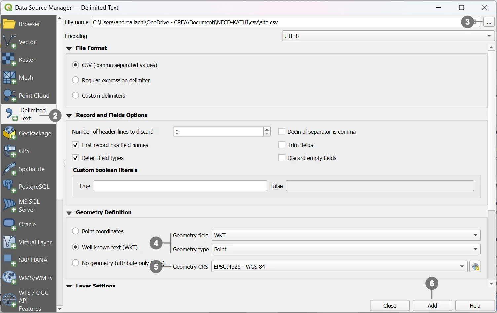
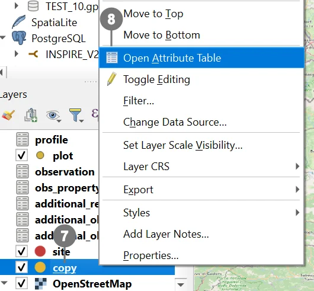
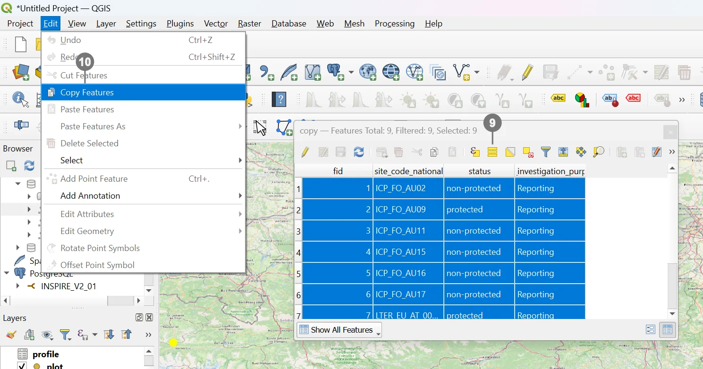

# Exporting a View from QGIS (e.g., to Excel)

This guide explains how to export a **view** from QGIS and what the two key export options do when saving to spreadsheet formats.

## Steps

### 1) Importing geometries

QGIS allows the import of geometries from various formats, such as CSV, Shapefile, or other GeoPackages. In this example, we will import data from a CSV file.

  
Click the <strong>Open Data Source Manager</strong> button ① in the QGIS toolbar.

  

  
  In the window that opens, you can choose from various data sources to import.
  In our example, select <strong>CSV</strong> ② as the source format and proceed with importing the desired file ③.
   
  Check the <strong>geometry type</strong> (e.g., WKT or coordinates separated into latitude/longitude) ④.
  
  Set the correct <strong>Coordinate Reference System (CRS)</strong> ⑤.
  
  Click <strong>Add</strong> ⑥ to create the layer (in this case, a point layer) in the project.

  

> [!WARNING]
> For the copy–paste operation to work correctly, the **source layer** (from which geometries are copied) must have the **same fields** (name and data type) as the **destination layer**, or at least match the required fields.  
> This check can be done during the import phase, later using QGIS tools, or by using an RDBMS to modify or remove unnecessary fields.  
> In this example, since the check was not performed during import, a temporary support layer named **“copy”** was created and used for preprocessing.

### 2) Copying geometries

  
Import the newly created layer (if it is not already present in the project).
   
Right‑click the layer name ⑦ and, from the context menu, select <strong>Open Attribute Table</strong> ⑧ to view its data.

  

  
<strong>Select all</strong> geometries ⑨
   
<strong>Copy</strong> the geometries ⑩.

  

1) **Select the object to export** (in this case, your view) and **right‑click** to open the **context menu**.  
2) Choose **Export**.  
3) Click **Save Features As…** to open the **Export** dialog.  
4) In the **Export** dialog, select the **output format** you need (for Excel: `MS Office Open XML spreadsheet [XLSX]`).  
5) Set the **output file name** and **location**. If needed, choose **which fields to export** (by default, **all fields** are exported).  

6) **Use aliases for exported name**  
Exports column headers using the **field aliases** (or the **Export name** set in the field mapping) instead of the raw database field names.  
Useful when the file is intended for non‑technical users or when you need translated headers.  
If this option is unchecked, the **original field names** will be used.

7) **Replace all selected raw field values by displayed values**  
Exports the **values as displayed in QGIS** (the “displayed/formatted values”) instead of the raw database values:  
e.g., **Value Relation** labels instead of keys, date/time formatted values, boolean values as “Yes/No”, numeric formatting, etc.  
Enable this when you want a more **human‑readable** output; leave it unchecked if you need the **original codes** for further data processing.

8) *(Optional)* Tick the option to **add the exported file back to the current project** after export (e.g., *Add saved file to map*), then click **OK** to finish.
