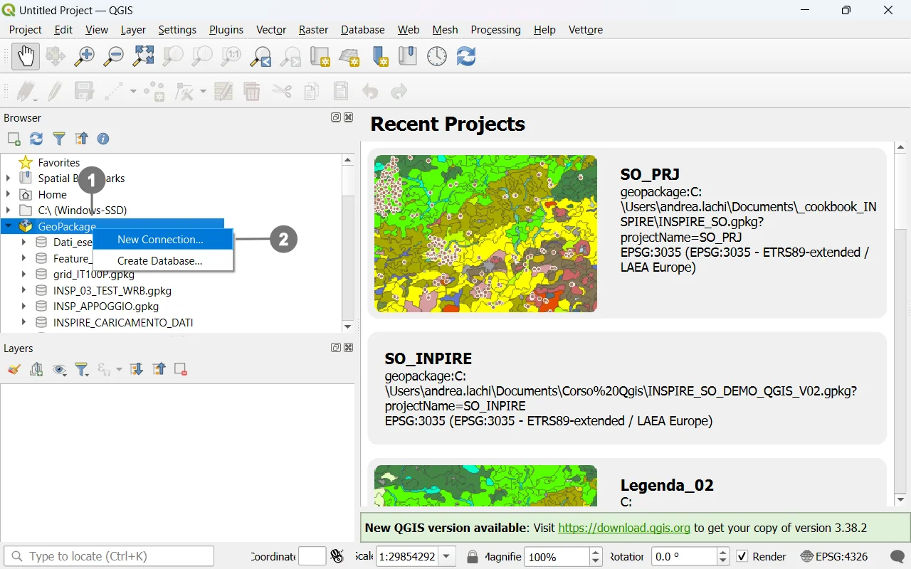
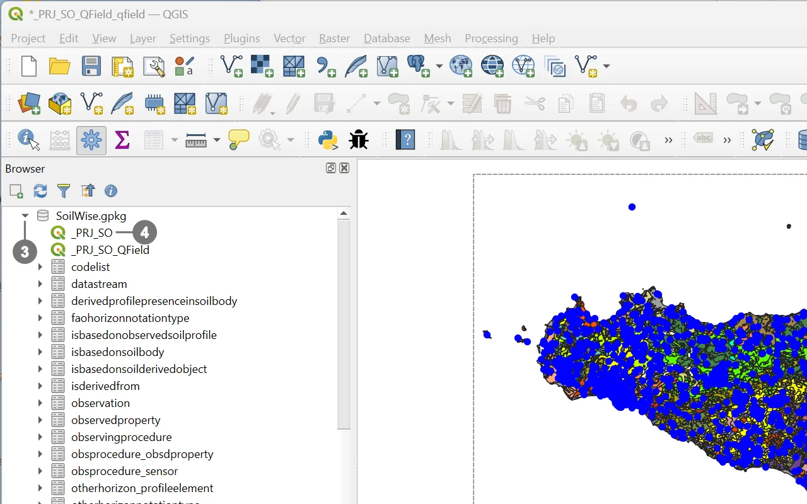

# Open the Soilwise Geopackage in QGIS

## Introduction

The **SoilWise GeoPackage** contains an **embedded QGIS project** named **`_PRJ_SO`** that exposes **preconfigured custom forms** to guide users in **data entry** and **visualization** 

This capability is available **even in the “empty” GeoPackage**, providing a consistent, ready‑to‑use working environment from the very beginning.

From a technical standpoint, the QGIS project is **stored directly inside the GeoPackage** in the **`qgis_projects`** table; each project is saved as **textual content** representing a **QGZ archive** (a zipped package) which, in turn, contains the **`.qgs` project file in XML format** [^1][^2]. This ensures that the project and the data live in the **same `.gpkg` file**, preserving styles, layouts, views, and settings as defined by SoilWise.

Opening is **one‑click**: select the **embedded project** from the GeoPackage and the SoilWise environment loads exactly as designed, with **forms, styles, and settings** ready to use.

## Open the _PRJ_SO Project

Open Qgis.

  
In the Browser Tab, right-click on the
Geopackage icon ① and click on “New
Connection”. ②

  

  
Search the file system for the Geopackage
file you want to use.

Inside the newly connected file, ③ you will
find the `_PRJ_SO` project. ④

Double-click on it, and the project will open.

  

> [!CAUTION]
> Given the system’s complexity, it is **strongly recommended to always use the complete project** to maintain data integrity.
> 
> Loading only a subset of layers may prevent records from being saved: QGIS cannot display or manage related objects if their corresponding layers are not loaded, and due to **relationships and internal database triggers**, this can lead to errors or failed save operations. 

> [!CAUTION]
>The GeoPackage contains two separate QGIS project files: one customized specifically for desktop use, named **_PRJ_SO**, and another configured for mobile data collection with QField, named **_PRJ_SO_Qfield**. Although both projects can be opened and used in QGIS, the **_PRJ_SO** project has been explicitly designed to take full advantage of QGIS capabilities, including advanced layer configurations, customized forms, validation rules, and all desktop-oriented functionalities described in this document.
> 
> For this reason, users are strongly advised to work with the **_PRJ_SO** project **when operating in QGIS**, ensuring optimal performance and full access to the project’s intended features.

> [!WARNING]
>If the GeoPackage **file has been renamed**, the project will not load correctly.  
>To resolve this issue, please refer to the solutions described in the documentation [How to Handle Issues Caused by Renaming the Soilwise GeoPackage](./rename_geopackage.md) 

[^1]: **QGIS User Manual – Working with Project Files**.  
https://docs.qgis.org/latest/en/docs/user_manual/introduction/project_files.html

[^2]: **GIS StackExchange – “Save as Project vs. Save as GeoPackage?”** (comment on how QGIS stores the project in the `qgis_projects` table as a zipped QGZ/XML).  
https://gis.stackexchange.com/questions/457189/save-as-project-vs-save-as-geopackage
