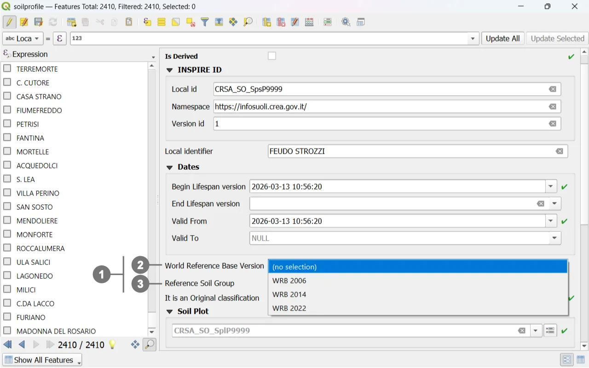
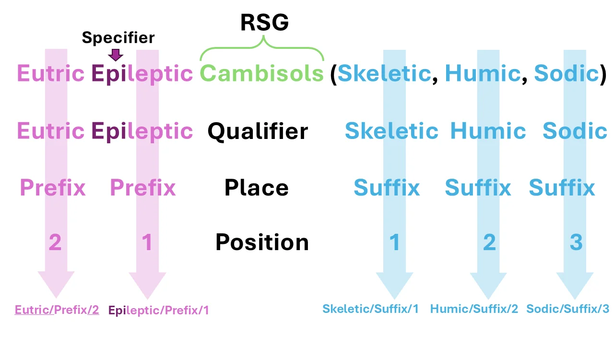
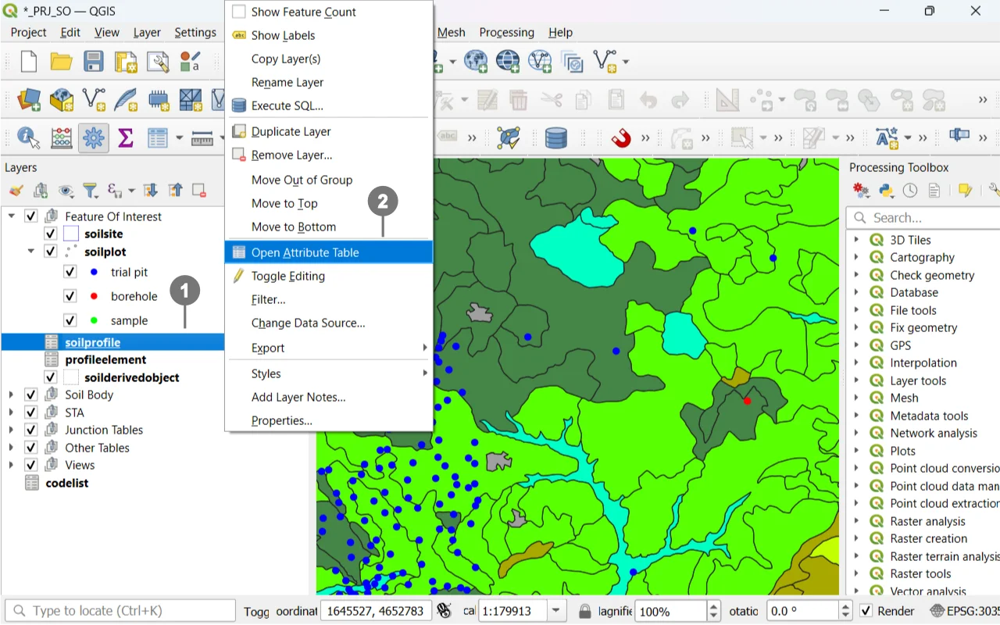
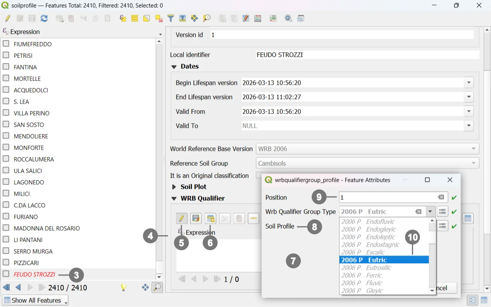
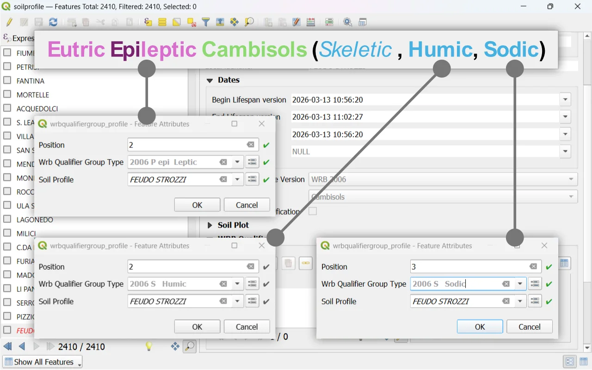
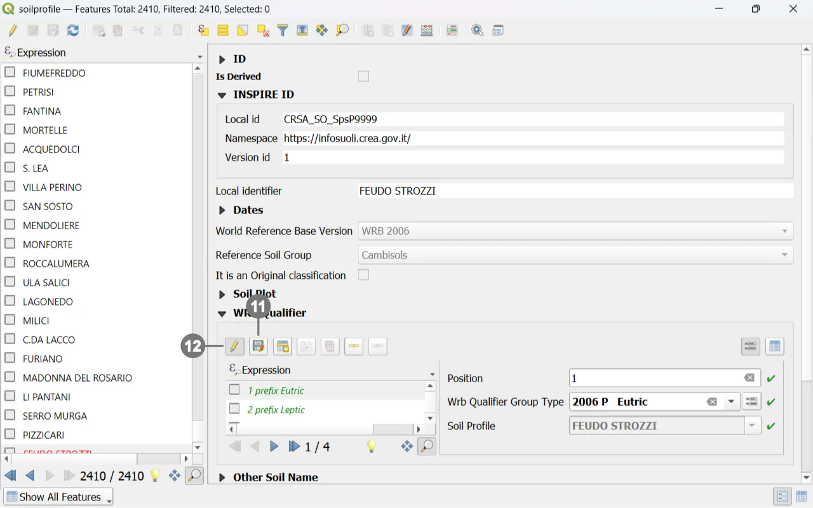
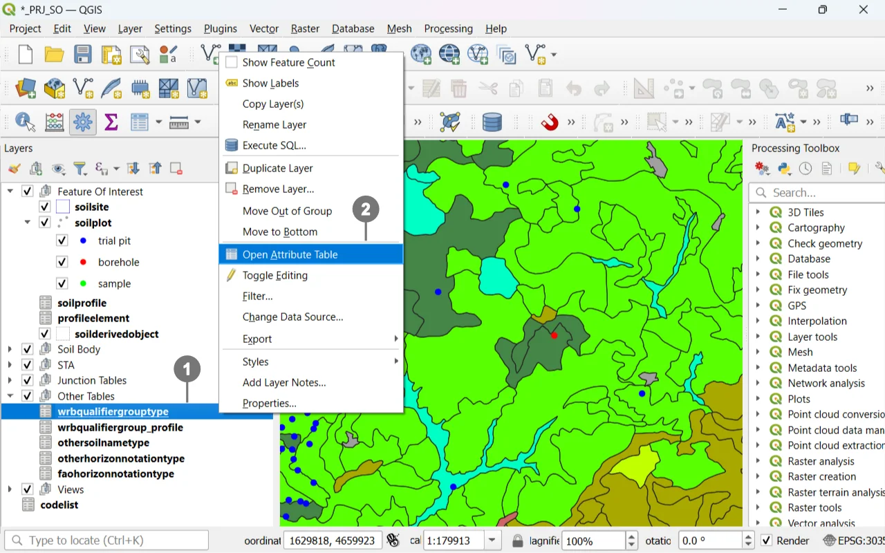
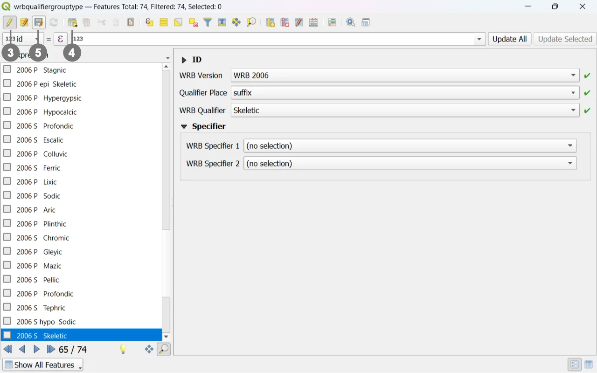
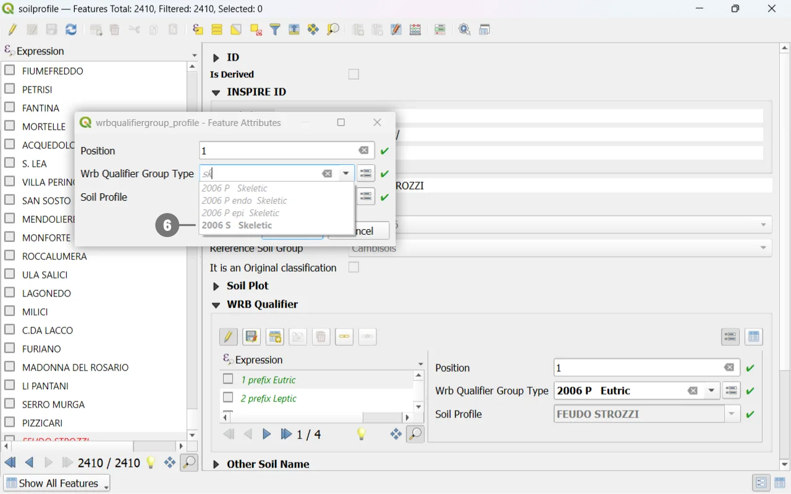

# WRB Classification in the Soilwise GeoPackage

The **World Reference Base for Soil Resources (WRB)** is today’s main international standard for soil classification, widely adopted in both scientific and operational contexts to ensure a common language among researchers, technicians, and institutions. Within the **Soilwise GeoPackage**, WRB is integrated through a structured set of domains, lookup tables, and controlled fields designed to guide the user in the consistent compilation of soil profile descriptive data.

This chapter explains how to correctly use the tools provided by the GeoPackage to classify a soil profile according to the WRB system — from identifying diagnostic features to assigning the **Reference Soil Group (RSG)** and the corresponding **qualifiers**.  
The goal is to provide a simple and reliable workflow that helps the user avoid common mistakes, maintain consistency with the official definitions, and produce a classification fully compliant with the WRB standard.

## Introduction

  
Among the attributes of a "Soil Profile", whether it is of type <strong>"Observed"</strong>strong> or <strong>"Derived"</strong>strong>, there is the option to insert the <strong>"World Reference Base"</strong>strong> classification ①.  
 
In the <strong>"Soil Profile"</strong>strong> form, you can select the classification year ② and the <strong>"Reference Soil Groups"</strong>strong>. ③   

  

  
As an example, to follow the workflow, let's take the following classification from the 2006 World Reference Base:  
 
 
- Indicate the <strong>"Reference Soil Groups"</strong>strong>, which has already been described in the <strong>"Soil Profile"</strong>strong>.  
 
- Specify the <strong>"Qualifier"</strong>strong>, and where applicable, the <strong>"Specifier"</strong>strong>.  
 
- Specify the <strong>"Qualifier Place"</strong>strong>, whether it is a prefix or a suffix.  
 
- Finally, define the <strong>"Position"</strong>strong> of the qualifier within the classification.< br>

  

## Detailing the Classification from the Soil Profile Form

  
In this case as well, a related table is edited directly from the form containing it. Right-click on the "Layers" panel on the "soilprofile" entry ① and from the menu, select "Open Attribute Table" ②.

  

  
Select a "Soil Profile" ③.
Navigate to the "WRB Qualifier" tab, ④ click the pencil icon "Toggle editing mode for child layer" ⑤ to make the tab editable, and then click the "Add Child Feature" button. ⑥  
 
A window will open ⑦ allowing you to insert both prefixes and suffixes and their position within the classification. 
 
The "Id Profile" field ⑧ will already contain the name of the selected "Soil Profile". 
 
Define the position ⑨ of the prefix or suffix within the classification. 
 
Search for the relevant prefix or suffix, ⑩ paying attention to the WRB year as well. 

  

  
It is possible to filter the list values by typing within the field. The letter "P" indicates a "Prefix", and "S" indicates a "Suffix". 
 
Close the window by clicking the "OK" button. 
 
Continue until the classification is completed by inserting all necessary prefixes and suffixes, starting again from step ⑥.

  

  
Click the "Save child layer edits" button ⑪ to save the edits, and then the "Toggle editing mode for child layer" button ⑫ to stop editing.

  

## Creating a new WRB Qualifier Group Type

  
We could not complete the classification in the example because the "dropdown menu" in the "Qualifier" field did not contain "WRB 2006 S Skeletic", so we need to create it. 
 
Right-click on the "Layers" panel on the "wrbqualifiergrouptype" entry ① and from the menu, select "Open Attribute Table". ②

  

  
In the "WRB Qualifier Group Type" window, click the first icon on the left named "Toggle Edit Mode",③  and then click the "Add Feature" icon. ④ 
 
Fill in the fields. 
 
It is also possible to define up to two specifiers. 
 
Click the "Save Layer Edits" button ⑤ to save the edits, and then the "Toggle Editing" button ③ to stop editing.

  

> [!NOTE]
> Selecting the WRB year will modify the values in the underlying selectors, providing the relevant options for the chosen classification type.

  
You can now complete the classification by adding the newly created suffix ⑥ by returning to the "Soil Profile" form.

  

